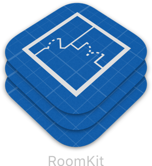

# RoomKit

[](https://travis-ci.org/dali-lab/RoomKit)
[](http://cocoapods.org/pods/RoomKit)
[](http://cocoapods.org/pods/RoomKit)
[](http://cocoapods.org/pods/RoomKit)

## Example

To run the example project, clone the repo, and run `pod install` from the Example directory first.

## Requirements

## Installation

RoomKit is available through [CocoaPods](http://cocoapods.org). To install
it, simply add the following line to your Podfile:

```ruby
pod 'RoomKit'
```

## Author

johnlev, john.lyme@mac.com

## License

RoomKit is available under the MIT license. See the LICENSE file for more info.
